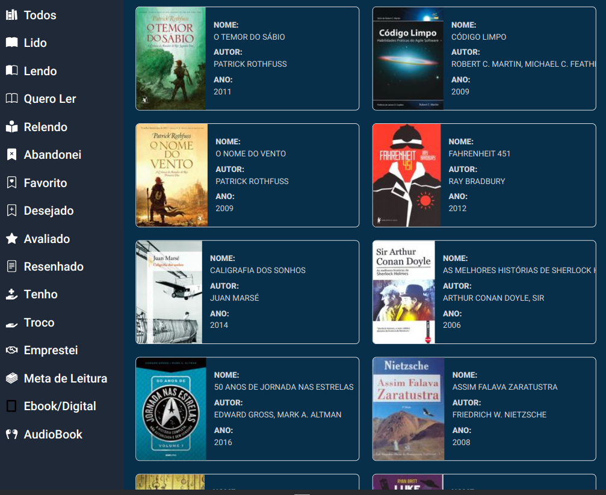

# Skoob-doo

A different UI to https://www.skoob.com.br/



# Progress

This is very early stage of what I would like to have as a UI replacement for the original and this is a side project.

# Motivation

Why? Because I love books and the original UI looks like the 90's internet. Also because I'm a frontend developer and I'm trying some new tech and learning experimentation.

# Project

This project is created with SvelteKit, for those who are familiar with it. If you wanna run locally:

```bash
npm install

npm run dev

# or run this to open the app in a new browser tab
npm run dev -- --open
```

# Getting the ID

To get your ID, so you can view your books on the shelfs, you have to login into the original platform and check your profile's url. It will look like `skoob.com.br/usuario/[your id here]`
